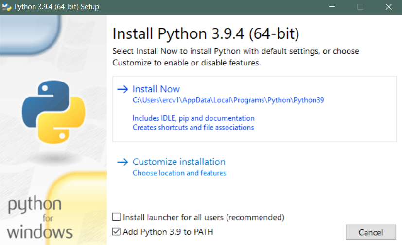

# Summary LOGs Chatbot
---
## Install requirements
This only works on a Windows OS.<br>
Before you do anything install [python](https://www.python.org/downloads/windows/), while doing that be sure to add python to the path 

Then make sure that the requirements are correctly installed. The dependencies can be installed via command line: 

`pip`

```shell
~$ python -m pip install -r requirements.txt
```
## Prepare data
Download de log files from [drive](https://drive.google.com/drive/folders/1_dCz7T78J33P0bEUoXRHfZyCNLC5UCy6), and place it `logs/` folder.

## Run Server
After getting the requirements run the `summary_logs.py`

```shell
~$ python summary_logs.py
```

---
### Collaborators
    Eric Gómez - A01378838@exatec.tec.mx
    Antonio Rangel - A01377364@exatec.tec.mx
    Rafael Moreno - A01378916@exatec.tec.mx
    Juan Manuel Gómez - A01372942@exatec.tec.mx
    Uriel Pineda - A01379633@exatec.tec.mx
    Hector Hernandez - A01374009@exatec.tec.mx